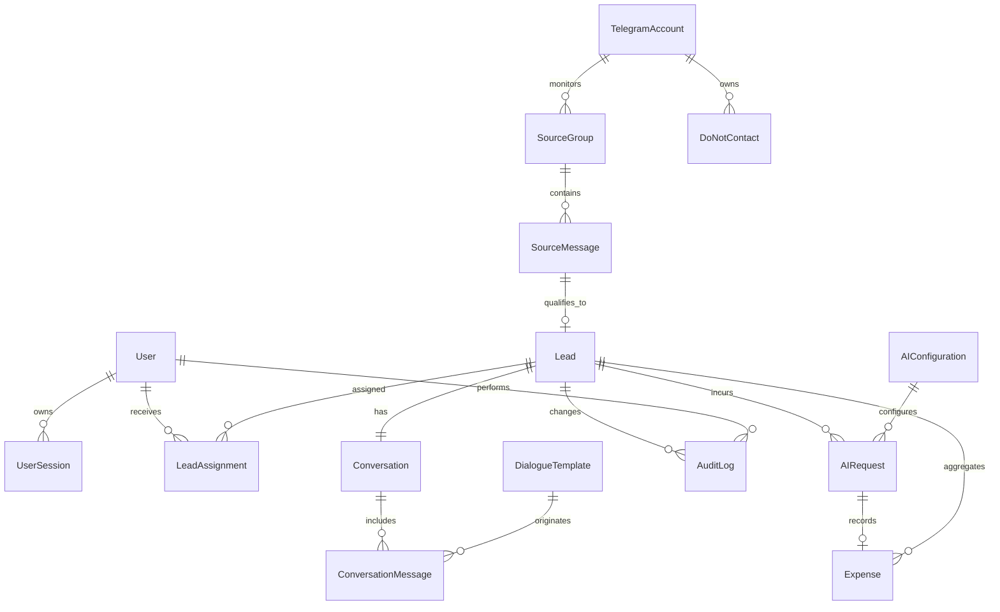

# Модель данных

## Общие правила

Время хранится в UTC. Первичные ключи — UUID. Все поля, перечисленные в таблице как основные, обязательны, если рядом явно не указано `nullable`, «при наличии» или отдельное условие. Персональные данные минимизируются: не хранить коды авторизации, пароль 2FA, API-ключи, содержимое секретов и ненужные контакты. Доступ к Telegram ID, username и добровольно переданным контактам ограничен RBAC и аудитом. Полный текст исходного сообщения и переписки относится к чувствительным данным и не должен попадать в обычные технические логи.

## Сущности

| Сущность | Назначение и основные обязательные поля | Связи, ограничения и индексы |
|---|---|---|
| `User` | Реализовано: `id`, `email` (`CITEXT`), `full_name`, `password_hash`, `role`, `is_active`, `must_change_password`, timestamps входа/смены пароля. | Email регистронезависимо уникален; пароль только Argon2id hash; роли `ADMIN`/`EMPLOYEE`. |
| `UserSession` | Реализовано: `id`, `user_id`, SHA-256 hashes session/CSRF tokens, `expires_at`, `last_seen_at`, `revoked_at`, безопасно ограниченные IP/User-Agent. | Поиск только по уникальному token hash; активный индекс `(user_id, expires_at, revoked_at)`; raw tokens не сохраняются. |
| `TelegramAccount` | Единственная рабочая учётная запись: `id`, `label`, `telegram_user_id`, `status`, `session_secret_ref`, `last_checked_at`. | `telegram_user_id` уникален; один активный аккаунт — частичный уникальный индекс MVP. Сессия только как зашифрованный секрет/ссылка на vault; не хранить код, 2FA и raw session в логах. |
| `SourceGroup` | Разрешённая группа: `id`, `account_id`, `chat_id`, `title`, `source_url`, `category`, `keywords`, `monitoring_enabled`, `last_processed_message_id`, `last_processed_at`. | Уникально `(account_id, chat_id)`; индекс по включённости. Связь с сообщениями. |
| `SourceMessage` | Неизменяемый снимок входящего: `id`, `source_group_id`, `telegram_message_id`, `author_telegram_id` (nullable), `author_username` (nullable), `text`, `sent_at`, `received_at`, `processing_status`. | Уникально `(source_group_id, telegram_message_id)`; индексы `(source_group_id, sent_at)`, `processing_status`. Текст не в техлогах; удалить/замаскировать по политике хранения. |
| `Lead` | Карточка кандидата: `id`, `source_message_id`, `status`, `relevance_score`, `urgency`, `problem_category`, `ai_summary`, `dialogue_mode`, `detected_at`, `state_version`. | Один лид на источник: `source_message_id` unique; индексы `(status, detected_at)`, `(assigned_user_id, status)` через назначение, `(problem_category, urgency)`. Содержит только необходимые персональные поля через источник. |
| `Conversation` | Контекст общения: `id`, `lead_id`, `telegram_account_id`, `peer_telegram_id`, `mode`, `last_inbound_at`, `last_outbound_at`, `lock_version`, `closed_at`. | `lead_id` unique; индексы `(mode, last_inbound_at)`. `peer_telegram_id` не дублирует источник без необходимости; не хранить контакты, не сообщённые пользователем. |
| `ConversationMessage` | Сообщение и отправка: `id`, `conversation_id`, `direction`, `author_type`, `text`, `telegram_message_id` (nullable), `delivery_status`, `idempotency_key`, `sent_at`. | Unique `(conversation_id, idempotency_key)` и при наличии `(conversation_id, telegram_message_id)`; индекс истории `(conversation_id, sent_at)`. Не писать текст в логи. |
| `LeadAssignment` | История ответственности: `id`, `lead_id`, `user_id`, `assigned_by`, `assigned_at`, `released_at`, `reason`. | Частичный unique active assignment на лид; индексы текущего сотрудника. |
| `AIRequest` | Учёт каждого решения: `id`, `lead_id` (nullable для фильтра), `purpose`, `provider`, `model`, `policy_version`, `input_tokens`, `output_tokens`, `latency_ms`, `status`, `error_code`, `created_at`. | Индексы `(lead_id, created_at)`, `(status, created_at)`, `(provider, model)`. Не хранить API-ключ; промпт/ответ хранить только при утверждённой политике маскирования. |
| `Expense` | Денежная запись: `id`, `lead_id` nullable, `ai_request_id` nullable, `kind`, `amount`, `currency`, `occurred_at`. | Уникальный `ai_request_id` для расчётной AI-строки; индексы `(occurred_at)`, `(lead_id, occurred_at)`. |
| `DoNotContact` | Запрет контакта: `id`, `telegram_account_id`, `peer_telegram_id`, `reason`, `created_by`, `created_at`, `expires_at` nullable. | Unique `(telegram_account_id, peer_telegram_id)` для активного запрета; индекс проверки. Не хранить лишний профиль. |
| `SystemEvent` | Операционное событие: `id`, `type`, `severity`, `entity_type`, `entity_id`, `payload_redacted`, `occurred_at`, `resolved_at`. | Индексы `(severity, occurred_at)`, `(type, resolved_at)`. Payload обезличен. |
| `AuditLog` | Реализовано для auth/users: `id`, `actor_user_id` nullable, `event_type`, `target_type`, `target_id`, IP, User-Agent, безопасная JSONB metadata, `created_at`. | Индексы времени, события и автора. Централизованная фильтрация запрещает пароли, cookies, session/CSRF tokens, token hashes, Authorization и строки подключения. |
| `AIConfiguration` | Версионируемая конфигурация: `id`, `provider`, `model`, `purpose`, `enabled`, `cost_input_per_token`, `cost_output_per_token`, `budget_limit`, `version`. | Unique `(purpose, version)`, один активный конфиг на purpose; ключи только через secret reference. |
| `DialogueTemplate` | Утверждённый шаблон: `id`, `name`, `purpose`, `content`, `version`, `status`, `approved_by`. | Unique `(name, version)`; индекс активных шаблонов. Не включает ложные обещания или персональные сведения. |

## Целостность и хранение

`Lead.status` и `Conversation.mode` меняются только доменным сервисом с optimistic locking (`state_version`/`lock_version`). Отправленный текст неизменяем; исправления создают новую запись. Политика срока хранения, удаление по запросу и правовое основание обработки должны быть утверждены до реализации и отражены в настройках/процедурах, а не «по умолчанию» в коде.
