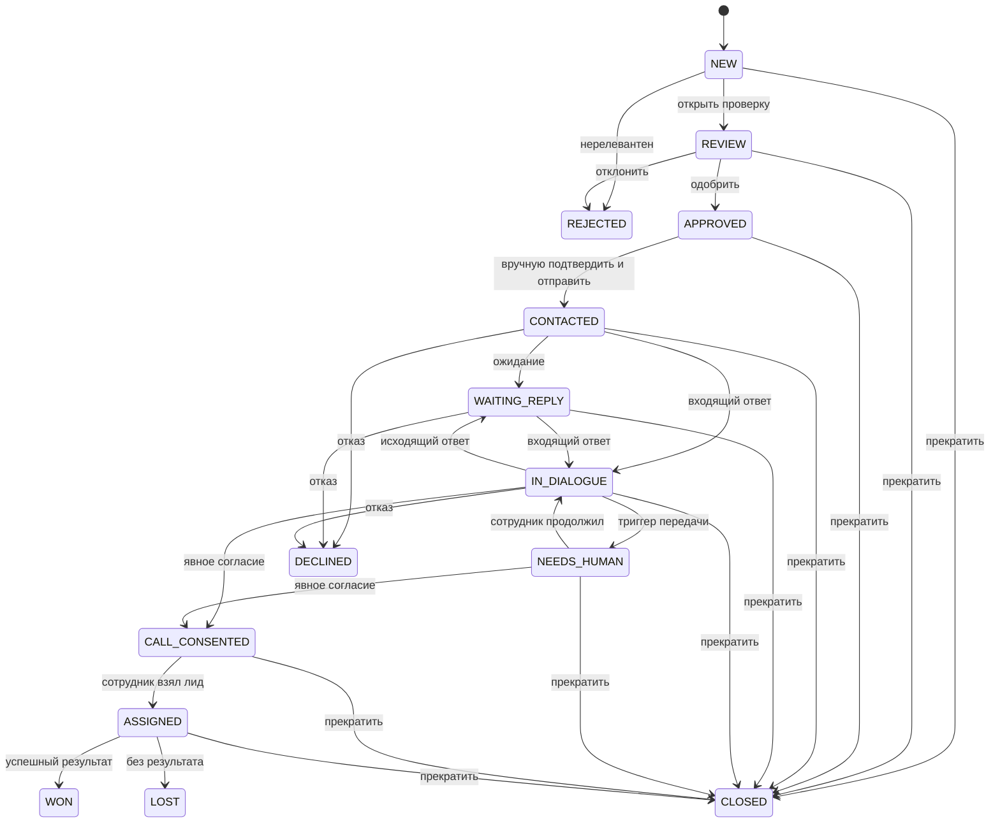

# Автомат статусов лида

## Статусы

| Статус | Значение | Вход / выход, событие и проверки |
|---|---|---|
| `NEW` | AI нашёл кандидата, общения нет. | Вход: успешная классификация. Выход: `REVIEW`, `REJECTED`, `CLOSED`. Проверка — уникальный источник; действие — создать карточку. |
| `REVIEW` | Сотрудник проверяет релевантность и допустимость контакта. | Из `NEW`; в `APPROVED`, `REJECTED`, `CLOSED`. Сотрудник/админ проверяет источник, стоп-лист и сценарий. |
| `APPROVED` | Лид разрешён для первого сообщения. | Из `REVIEW`; в `CONTACTED`, `CLOSED`, `DECLINED`. Требуется ручное подтверждение текста, доступный аккаунт и нет глобальной паузы. |
| `CONTACTED` | Первое сообщение доставлено/принято Telegram, ожидается реакция. | Из `APPROVED`; в `WAITING_REPLY`, `IN_DIALOGUE`, `NEEDS_HUMAN`, `DECLINED`, `CLOSED`. Событие: отправка/входящий ответ/таймаут. |
| `WAITING_REPLY` | Ожидается ответ после любого исходящего сообщения. | Из `CONTACTED` или `IN_DIALOGUE`; в `IN_DIALOGUE`, `NEEDS_HUMAN`, `DECLINED`, `CLOSED`. Повторный контакт — только после отдельного согласования политики. |
| `IN_DIALOGUE` | Идёт разрешённый AI- или ручной диалог. | Из `CONTACTED`, `WAITING_REPLY`, `NEEDS_HUMAN`; в `WAITING_REPLY`, `NEEDS_HUMAN`, `CALL_CONSENTED`, `DECLINED`, `CLOSED`. Перед отправкой проверяются режим и блокировка. |
| `NEEDS_HUMAN` | Нужна реакция сотрудника. | Из активных статусов по триггеру политики; в `IN_DIALOGUE`, `CALL_CONSENTED`, `DECLINED`, `CLOSED`. AI не отправляет; сотрудник берёт лид. |
| `CALL_CONSENTED` | Зафиксировано однозначное согласие на созвон. | Из `IN_DIALOGUE`/`NEEDS_HUMAN`; в `ASSIGNED`, `CLOSED`. AI сразу останавливается, создаётся резюме и уведомление. |
| `ASSIGNED` | Сотрудник принял переданный лид. | Из `CALL_CONSENTED` или вручную из `NEEDS_HUMAN`; в `WON`, `LOST`, `CLOSED`. Есть активное назначение и `HUMAN_CONTROL`. |
| `WON` | Зафиксирован успешный бизнес-результат. | Из `ASSIGNED`; терминальный, кроме админской коррекции с аудитом. |
| `LOST` | Обработка завершена без результата. | Из `ASSIGNED`; терминальный, причина обязательна. |
| `REJECTED` | Кандидат нецелевой до контакта. | Из `NEW`/`REVIEW`; терминальный. |
| `DECLINED` | Человек отказался/попросил не писать. | Из активных статусов; терминальный. Режим `CLOSED`, при необходимости активный стоп-лист. |
| `CLOSED` | Общение прекращено по иной причине. | Из нетерминальных статусов; терминальный, причина обязательна. |

Все переходы, кроме автоматической классификации и политических триггеров, выполняет сотрудник или администратор в рамках прав. Автомат может создать `NEW`, перевести в `NEEDS_HUMAN` и, только при однозначном текстовом согласии с сохранённым сообщением-доказательством, перевести в `CALL_CONSENTED`. Неоднозначное согласие не меняет статус и передаётся человеку. Побочные действия: журнал перехода, WebSocket-событие, отмена несоответствующих задач и пересчёт агрегатов.

## Режимы управления диалогом

| Режим | Правило | Включение и выход |
|---|---|---|
| `AI_CONTROL` | AI может отправить только разрешённый политикой ответ. | После первого ручного сообщения; завершается по ручному перехвату, стопу, триггеру передачи или закрытию. |
| `HUMAN_CONTROL` | Отправляет только назначенный сотрудник/администратор. | Включается атомарно при взятии лида, согласии на созвон и передаче; выход — только явное возвращение в AI при разрешённом нетерминальном статусе и аудите. |
| `PAUSED` | Никто не отправляет, история доступна. | Глобальная/лидовая пауза; выход — явное безопасное возобновление. |
| `CLOSED` | Отправки запрещены навсегда для этого диалога. | При `DECLINED`, `CLOSED`, `WON`, `LOST`; повторное открытие только админом по утверждённой процедуре и не отменяет стоп-лист. |

Режим и статус связаны, но не тождественны: `NEEDS_HUMAN` может иметь `PAUSED` до принятия, а `ASSIGNED` обязан иметь `HUMAN_CONTROL`. Перед каждой отправкой проверяются обе величины.
