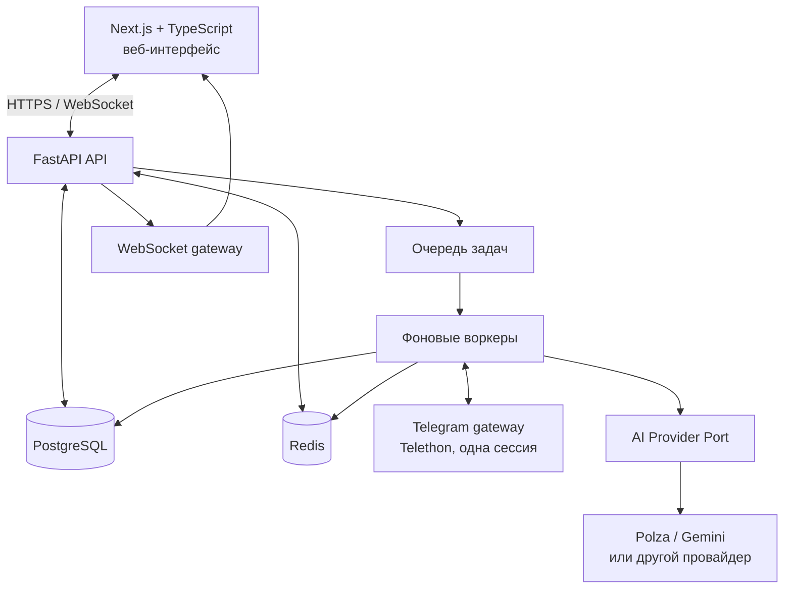

# Системная архитектура

## Принципы

Архитектура разделяет интерактивный интерфейс, API, обработку Telegram, фоновые задачи и AI. Исходящая отправка проходит через единственный контролируемый шлюз; ни UI, ни AI напрямую в Telegram не пишут. Это позволяет применить стоп-лист, паузу, лимиты, блокировку диалога и аудит непосредственно перед отправкой.

## Компоненты и ответственность

| Компонент | Ответственность | Граница |
|---|---|---|
| Next.js | Панель, Kanban, карточка лида, формы и живые обновления | Не хранит Telegram-сессию и не вызывает Telegram/AI напрямую |
| FastAPI | Аутентификация, RBAC, команды, чтение данных, валидация переходов, API и аудит | Не выполняет долгие Telegram/AI-вызовы в HTTP-запросе |
| PostgreSQL | Транзакционные данные, история, состояния, расходы, аудит | Источник истины для продукта |
| Redis | Кэш, распределённые блокировки, rate-limit, pub/sub и краткоживущие задачи | Не единственное место хранения бизнес-данных |
| Очередь + воркеры | Мониторинг, классификация, AI-диалог, уведомления, повторы | Задачи идемпотентны и имеют idempotency key |
| Telegram gateway (Telethon) | Одна авторизованная сессия, входящие обновления, контролируемые исходящие | Не принимает решения о лидах и не раскрывает сессию |
| AI Provider Port | Единый контракт classify / draft_reply / summarize | Адаптер Polza/Gemini заменяем, ответы валидируются схемой |
| WebSocket gateway | Передача событий UI: изменения лида, статусы, ошибки | Не является источником истины |

## Основные взаимодействия

1. Воркер Telethon получает обновление, сохраняет `SourceMessage` транзакционно и ставит локальную проверку.
2. Классификатор создаёт `AIRequest`, вызывает адаптер и валидирует JSON. При положительном результате сервис лида создаёт `Lead` и аудит.
3. HTTP-команда меняет состояние лида только через доменный сервис в транзакции; после commit публикуется событие в очередь/WebSocket.
4. Перед отправкой сообщения outbox-воркер берёт блокировку `conversation:{id}`, проверяет режим, назначение, стоп-лист, глобальную паузу, лимиты и уникальный ключ отправки. Затем отправляет через Telethon и сохраняет результат.
5. При ручном перехвате транзакция меняет режим на `HUMAN_CONTROL`, отменяет/делает неактуальными AI-задачи и публикует событие. Воркер проверяет версию режима непосредственно перед отправкой.

## Модули backend

- `auth/rbac`: сессия пользователя, роли, объектные права.
- `telegram_accounts` и `sources`: подключение, состояние аккаунта, группы и чтение обновлений.
- `leads` и `conversations`: автомат статусов, Kanban, назначение, блокировка отправки.
- `ai`: провайдерный порт, политики, бюджеты, учёт токенов и структурированные результаты.
- `messaging`: outbox, шаблоны, лимиты, стоп-лист, отправка и синхронизация истории.
- `analytics`: агрегаты воронки, затрат и качества.
- `operations`: health, события, аудит, алерты и аварийные переключатели.

## Надёжность и масштабирование

Один логический Telegram gateway владеет единственной сессией и не запускается параллельно. Воркеры остальных типов могут масштабироваться, но блокировка диалога и уникальные ключи исключают дубли. PostgreSQL-хранилище содержит состояние до постановки транзакционного outbox; обработчик может безопасно повторить задачу. После перезапуска gateway сверяет последнюю подтверждённую позицию по каждой группе и продолжает обработку.

## Будущее без преждевременной сложности

В модели `TelegramAccount` и AI-адаптере есть расширяемые границы, но MVP конфигурирует один активный аккаунт и один провайдер. Мультиаккаунтность, tenancy и ротация не реализуются и не закладываются как способы обхода правил Telegram.
